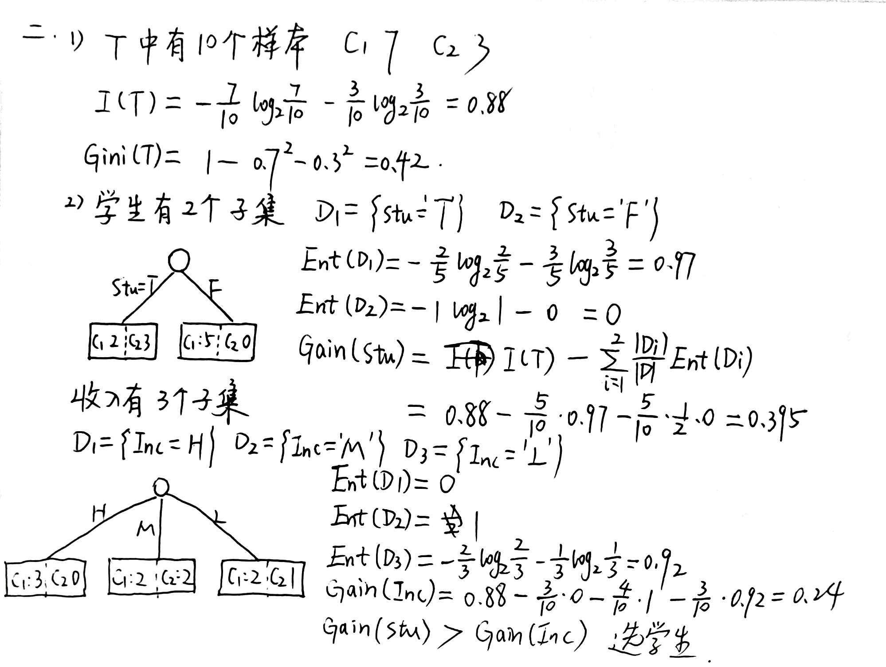
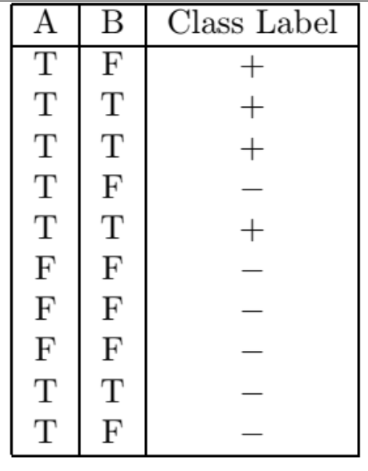
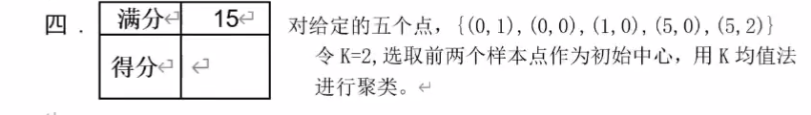
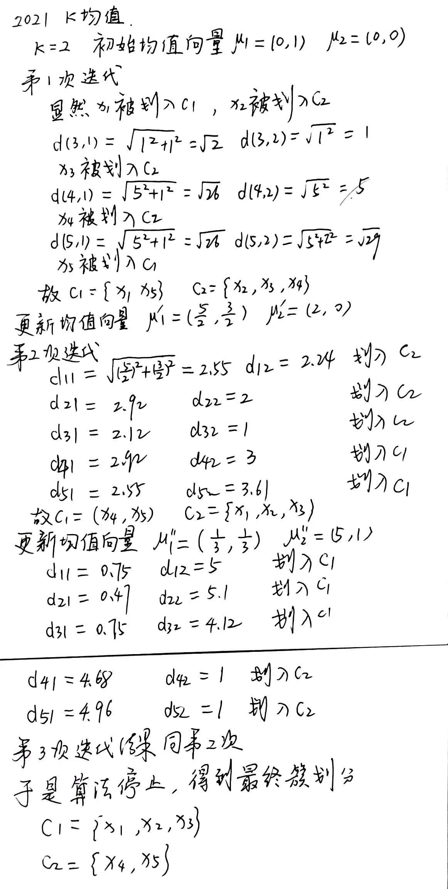
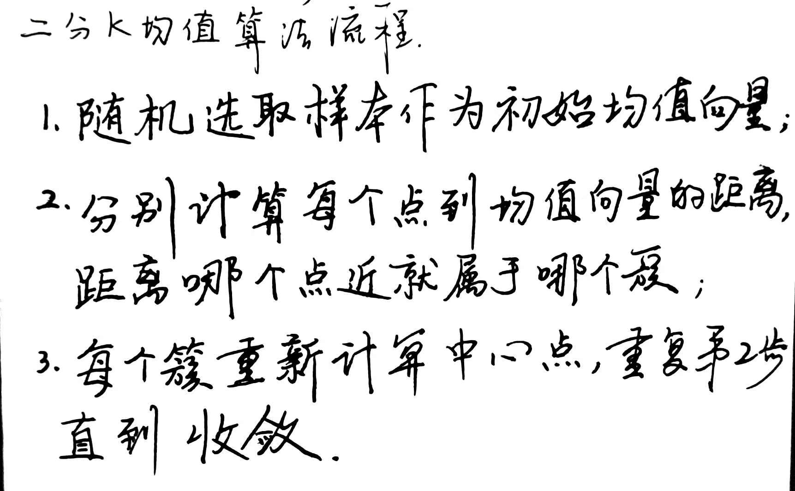
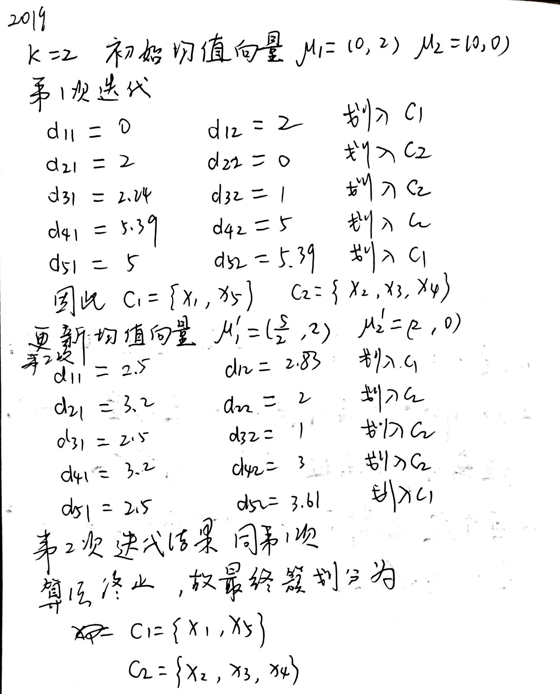
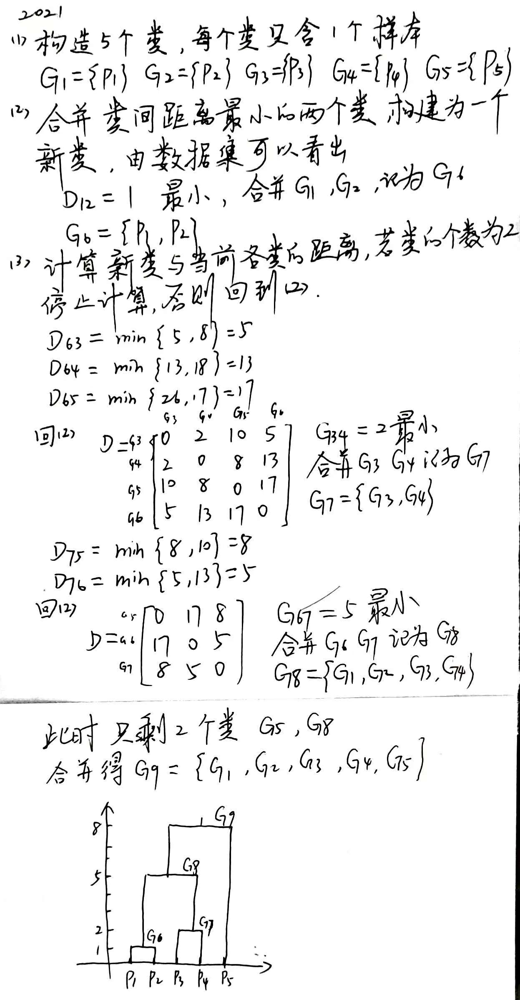
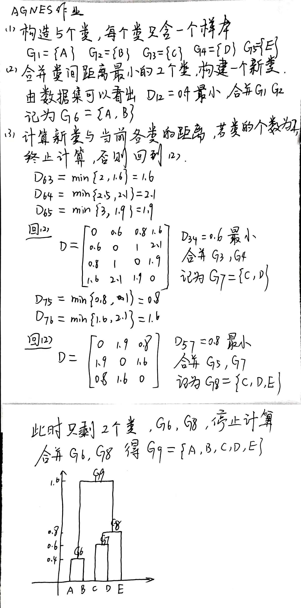

# content

1. [Notes](#1-Notes)
2. [贝叶斯分类](#2-贝叶斯分类)
3. [决策树](#3-决策树)
4. [支持向量机](#4-支持向量机)
5. [K均值](#5-k均值)
6. [AGNES](#6-agnes)
7. [Adaboost](#7-adaboost)

## 1 Notes

1. 属于**监督学习**的机器学习算法是：**（贝叶斯分类器，线性回归，逻辑回归，决策树，KNN）**
2. 属于**无监督学习**的机器学习算法是：**（K-means，层次聚类）**
3. 朴素贝叶斯分类器的特点是：假设样本各维属性**独立**
4. 对于正态密度的贝叶斯分类器，各类协方差矩阵相同时，决策函数为：**线性决策函数**
5. 下列方法不受数据归一化影响的是：**决策树**
6. 下列方法使用最大似然估计的是：**逻辑回归**
7. SVM的原理：**最大间隔分类**
8. SVM的算法性能取决于：**（核函数的选择，核函数的参数，软间隔参数C）**
9. 支持向量机的归偶问题是：**凸二次优化**
10. 对支持向量机中的支持向量的描述正确的是：**最大间隔支撑面上的向量**
11. 假定你使用阶数为2的线性核SVM，将模型应用到实际数据集上后，其训练准确率和测试准确率均为100%。现在增加模型复杂度（增加核函数的阶），会发生以下哪种情况：**过拟合**
12. 避免直接的复杂非线性变换，采用线性手段实现非线性的学习方法是：**核函数方法**
13. 关于决策树节点划分指标描述正确的是：**信息增益越大越好**
14. 属于决策树策略的是：**最大信息增益**
15. 集成学习中基分类器的选择怎样使得学习效率提高：**分类器多样，差异大**
16. 集成学习中，每个基分类器的正确率最低要求：**50%以上**
17. 随机森林方法属于：**Bagging方法**
18. 一般，K-NN最近邻方法在什么情况下效果好：**样本较少但典型性较好**
19. 回归问题和分类问题的区别：**前者预测函数值为连续值，后者为离散值**
20. 正则化的回归分析，可以避免：**过拟合**
21. 密度聚类方法充分考虑了样本间的什么关系：**密度可达**
22. 混合高斯聚类中，运用了以下哪种过程：**EM算法**
23. 主成分分析是一种什么方法：**降维**方法
24. 过拟合现象中：训练样本的测试误差最**小**，测试样本的正确识别率却很**低**
25. 关于k-means算法，正确的描述是：**初始值不同，最终结果可能不同**
26. 下列关于过拟合现象的描述中，哪个是正确的：**训练误差小，测试误差大**
27. 层次聚类--凝聚（自底向上）和分裂（自顶向下）
28. AdaBoost后一个基学习器要依赖于前一个基学习器的分类错误率和样本的权重
29. 高斯混合分布中，隐变量表示数据从某个高斯分布中产生
30. 两个半径不同的环状聚类，采用单链接的层次聚类可以完成聚类

## 2 贝叶斯分类

### 2.1 2021贝叶斯

  
解：  

  
解：  


---

### 2.2 2019贝叶斯

  
  
  
[答案 <- 第7题](https://www.jianshu.com/p/8ddc0876dc3b)

---

### 2.3 贝叶斯作业题


## 3 决策树

### 3.1 2021决策树

  

  
解：  


---

### 3.2 2019决策树

  
  

```python
import math
# 如果可以用python计算的话
t = [2, 1]  # 修改t， 6，4为正负样本的个数
IT = 0
GiniT = 1
for i in t:
    IT -= i/sum(t)*math.log2(i/sum(t))
    GiniT -= pow(i/sum(t), 2)
print("信息熵I(T)=%.4f" % IT)
print("基尼指数Gini(T)=%.4f" % GiniT)
```


  


---

### 3.3 决策树作业题




---

## 4 支持向量机

### 4.1 2021SVM

  
只需写出原问题和对偶问题即可。


---

### 4.2 2019SVM

  


---

### 4.3 SVM作业题


## 5 K均值

> 如果可以用Python计算的话

```python
def ou_long(a, b):
    d = pow(pow(a[0] - b[0], 2) + pow(a[1] - b[1], 2), 1 / 2)
    return d


u1 = [2.5, 2]  # u1 u2是均值向量
u2 = [2, 0]  # 需要自己修改
x = [[0, 2], [0, 0], [1, 0], [5, 0], [5, 2]]
print("初始均值向量为u1 = (%.2f, %.2f), u2 = (%.2f, %.2f)" % (u1[0], u1[1], u2[0], u2[1]))
for i in range(1, len(x) + 1):
    print("x%d 到 u1 的长度 = %.2f    x%d 到 u2 的长度 = %.2f" % (i, ou_long(x[i - 1], u1), i, ou_long(x[i - 1], u2)))
    if ou_long(x[i - 1], u1) < ou_long(x[i - 1], u2):
        print("x%d 应被划入 c1" % i)
    else:
        print("x%d 应被划入 c2" % i)
```


### 5.1 2021K均值



---

### 5.2 2019K均值



---

### 5.3 K均值作业题




## 6 AGNES算法

### 6.1 2021AGNES




---

### 6.2 2019AGNES


略

---

### 6.3 AGNES作业题





## 7 Adaboost

### 7.1 2021Adaboost


---

### 7.2 2019Adaboost


---

### 7.3 Adaboost作业题


