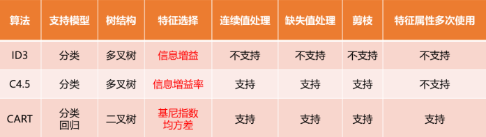
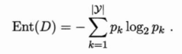
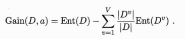
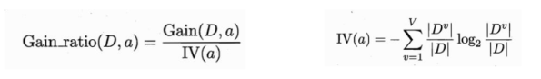
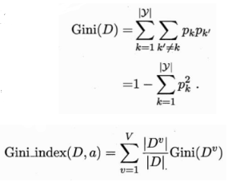

# 决策树

## 1 基本流程

### 1.1 基本概念

1. 决策树：从训练数据中学习得出一个树状结构的模型。
2. 决策树属于“判别模型”。 
3. 决策树算法属于**监督学习**方法。
4. 决策树是一种**树状结构**，通过做出一系列的决策来对数据进行划分，这类似于针对一系列问题进行选择。
5. 决策树的**决策过程**：从根结点开始，测试待分类项中对应的特征属性，并按照属性值选择输出分支，直到叶子节点，将叶子节点的存放的类别作为决策结果。
6. 决策树算法是一种**归纳分类**算法，它通过对训练集的学习，挖掘出有用的规则，用于对新数据进行预测。
7. 决策树归纳的基本算法是**贪心算法**，自顶向下来构建决策树。
8. 在决策树的生成过程中，分割方法即**属性选择的度量**是关键。
9. 决策过程中提出的每个判定问题都是对某个属性的测试；
10. 决策过程的最终结论对应了我们希望的判定结果；
11. 从根结点到每个叶结点的路径对应了一个判定测试序列；
12. 决策树学习的**目的**是：产生一棵泛化能力强，即处理未见示例能力强的决策树。

### 1.2 特点

1. **优点**
   1. 推理过程容易理解，计算简单，可解释性强。
   2. 比较适合处理有缺失属性的样本。
   3. 可自动忽略目标变量没有贡献的属性变量，也为判断属性变量的重要性、减少变量的数目提供参考。
2. **缺点**
   1. 容易造成**过拟合**，需要剪枝。
   2. 忽略了数据之间的相关性，
   3. 对于各类别样本数量不一致的数据，信息增益会偏向于那些更多数值的特征。

### 1.3 三种基本类型

### 1.4 步骤

1. 特征选择
   1. 特征选择决定了使用哪些特征来做判断。在训练数据集中，每个样本的属性可能有很多个，不同属性的作用有大有小。因而特征选择的作用就是筛选出跟分类结果相关性较高的特征，也就是分类能力较强的特征。
   2. 在特征选择中通常使用的准则是：信息增益。
2. 决策树生成
   1. 选择好特征后，就从根节点出发，对节点计算所有特征的信息增益，选择信息增益最大的特征作为节点特征，根据该特征的不同取值建立子节点；
   2. 对每个子节点使用相同的方式生成新的子节点，直到信息增益很小或者没有特征可以选择为止。
3. 决策树剪枝——剪枝的主要目的是对抗「过拟合」，通过主动去掉部分分支来降低过拟合的风险。

## 2 划分选择

* 决策树学习的关键在于如何选择最优划分属性。
* 一般而言，随着划分过程不断进行，我们希望决策树的分支结点所包含的样本尽可能属于同一类别，即结点的纯度越来越高。
* 经典的属性划分方法：
  * 信息增益
  * 增益率
  * 基尼指数

### 2.1 ID3算法——基于信息增益

1. 信息熵是度量样本集合纯度最常用的一种指标。
2. 信息熵Ent(D)的值越小，则D的纯度越高。
3. 计算公式 
   1. 规定：若p=0，则该项为0
   2. Ent(D)的最小值为0，最大值为log2\|y\|
4. 信息增益：先计算出信息熵，再考虑到不同的分支结点所包含的样本数不同，给每个分支结点赋予权重，样本数越多的分支结点的影响越大，于是可计算出属性a对样本D进行划分所获得的“信息增益”。
5. 计算公式：
6. 一般而言，**信息增益越大越好**。
7. **ID3**决策树学习算法，以**信息增益**为准则来选择划分属性。**步骤**：
   1. 初始化特征集合和数据集合；
   2. 计算数据集合信息熵和所有特征的条件熵，选择信息增益最大的特征作为当前决策结点；
   3. 更新数据集合和特征集合。
   4. 重复2,3两步，若子集只包含单一特征，则为分支叶子结点。
8. 存在的**问题**：
   1. 信息增益对可取值数目较**多**的属性有所偏好。
   2. 没有剪枝策略，容易过拟合。
   3. 只能用于处理离散分布的特征。
   4. 没有考虑缺失值。

### 2.2 C4.5算法——基于信息增益率

1. C4.5决策树算法采用“信息增益率”来选择最优划分属性。
2. 计算公式：
3. 存在的**问题**：增益率准则对可取值数目较**少**的属性有所偏好。
4. C4.5算法是对ID3算法的改进：
   1. 采用信息增益率来选择属性。
   2. 在决策树构造过程中进行剪枝。
   3. 对非离散数据也能处理。
   4. 能够对不完整数据进行处理。
5. 缺点：
   1. 用的是多叉树，用二叉树效率更高。
   2. 只能用于多分类。
   3. 有大量耗时的对数运算，连续值还有排序运算。
   4. 只适合于能够驻留于内存的数据集，当训练集大得无法在内存中容纳时，程序无法运行。

### 2.3 CART算法——基于基尼指数

1. CART采用“基尼指数”来选择划分属性。
2. 基尼值Gini(D)越小越好。
3. 计算公式：
4. 用基尼指数来选择属性（分类），或用均方差来选择属性（回归）。
5. 既可用于分类问题，也可用于回归问题。

## 3 减枝处理

## 4 连续和缺失值

## 5 多变量决策树

