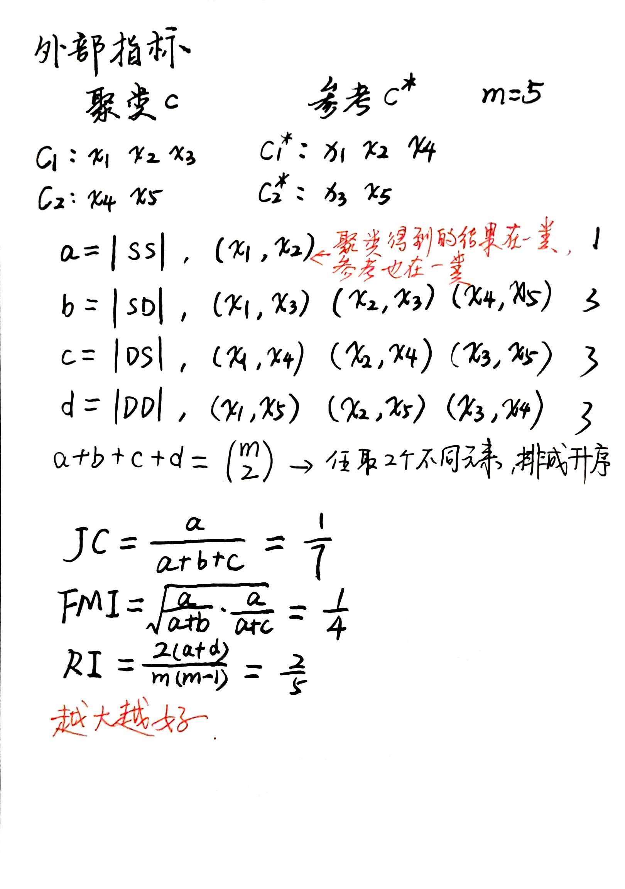
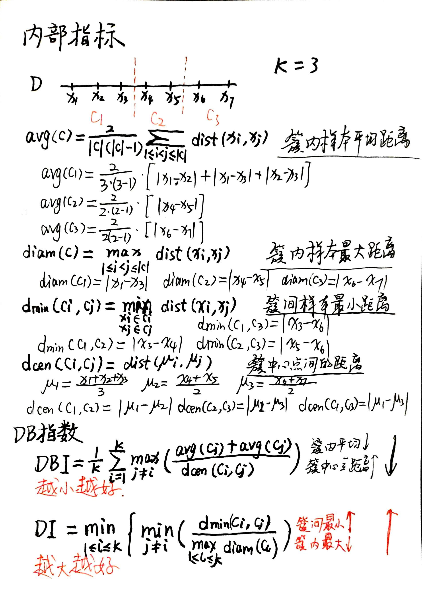

# 聚类

## 1 聚类任务

> 聚类的目的。

* 监督学习和无监督学习
  * **监督学习**有标签；
  * **无监督学习**无标签，即训练样本的标记信息是未知的，**目标**是通过对无标记训练样本的学习来揭示数据的内在规律，为进一步的数据分析提供基础。
* 聚类**大部分**属于 无监督学习，学习向量量化属于 监督学习。
* 聚类的**目的**：将数据集中的样本划分为若干个通常是不相交的子集，每个子集称为一“**簇**”。每个簇对应一种类别。

## 2 性能度量

> 评估什么是好的聚类。

* 聚类 性能度量又称“有效性指标”。
* 对聚类的结果，我们通常要**通过对某种性能度量来评估其好坏**；
* 若明确了最终将要使用的性能度量，则可以直接将其作为聚类过程的**优化目标**，从而更好地得到符合要求的聚类结果。
* **什么样的聚类结果好**？簇内相似度高 且 簇间相似度低。
* 性能度量分**两类**：
  * 将聚类结果与某个“参考模型”进行比较，称为“外部指标”；
    * Jaccard系数
    * FM系数
    * Rand系数
    * 性能指标的值在[0,1]区间内，越大越好。
  * 直接考察聚类结果而不利用任何参考模型，称为“内部指标”。
    * DB系数
    * Dunn系数
    * DB系数越小越好，Dunn系数越大越好。

## 3 距离计算

> 样本间的距离怎么确定？

### 3.1 距离度量/非距离度量

距离度量应该满足的**性质**：

* 非负性
* 同一性
* 对称性
* 直递性

### 3.2 有序属性/无序属性

有序属性

* 闵可夫斯基距离
* 欧氏距离
* 曼哈顿距离

无序属性

* VDM距离
* 混合距离
* 加权距离

## 4 原型聚类

原型聚类先**对原型进行初始化**，然后对原型进行**迭代更新求解**。  
采用不同的原型表示、不同的求解方式，将产生不同的算法。

### 4.1 K均值方法

步骤：

1. 随机选取样本作为初始均值向量。（初始值：k的值，即有几个簇）
2. 分别计算每个样本点到初始均值向量的距离，距离哪个点最近就属于哪个簇。
3. 每个簇重新计算中心点，重复第二步直到收敛。
